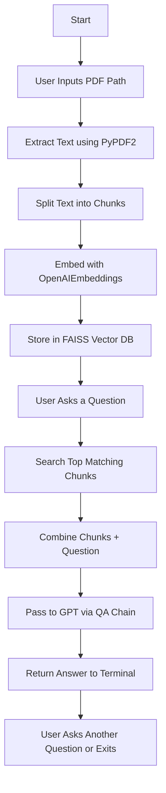

# RAG PDF QA System

A **Retrieval-Augmented Generation (RAG)** based question answering system built with Python. This tool allows you to provide a **PDF file**, extract its contents, and ask **natural language questions** in the terminal, with answers generated using **OpenAI GPT models**.

---

## 1. Setup Guide

### Prerequisites:

* Python 3.9 or later
* Virtual environment (recommended)

### Install Required Packages

Run this command in your terminal:

```bash
pip install -U \
    langchain \
    langchain-community \
    langchain-openai \
    openai \
    faiss-cpu \
    PyPDF2 \
    python-dotenv \
    tiktoken
```

### Add Your OpenAI API Key

Create a `.env` file in the project root:

```env
OPENAI_API_KEY=your-api-key-here
```

---

## 2. Introduction & How It Works

This project reads a PDF file, splits its content, converts it into vector embeddings, stores it using a FAISS vector store, and answers questions using OpenAI's GPT model.

### Package Responsibilities (Load Order):

1. **PyPDF2** — for reading PDF files
2. **langchain.text\_splitter** — for splitting the text into chunks
3. **langchain-openai** — for embeddings and GPT-3.5/GPT-4 models
4. **faiss-cpu** — for storing and searching vector embeddings
5. **langchain chains** — for chaining documents with the question and sending to GPT
6. **dotenv** — for securely loading your OpenAI API key
7. **tiktoken** — for token length handling (used by OpenAIEmbeddings)

---

## 3. Logic - How It Works

### Step-by-Step:

1. **User provides a PDF path** via terminal.
2. **PyPDF2** reads and extracts all text from the PDF.
3. **LangChain's TextSplitter** breaks the text into smaller, overlapping chunks.
4. **OpenAIEmbeddings** converts chunks into numerical vector embeddings.
5. **FAISS** stores these embeddings and allows similarity search.
6. When the user asks a question:

   * The system searches FAISS for top-k relevant chunks.
   * These chunks + the question are passed to **GPT (via LangChain QA chain)**.
   * The model generates a natural language answer.
7. The answer is shown in the terminal.

---

## 4. Mermaid Flowchart



---

## 5. Weaknesses & Future Improvements

### Known Limitations:

* No support for scanned/image-based PDFs (OCR not included)
* Limited PDF size — if the PDF is too long, processing may slow down or exceed token limits
* Basic terminal UI only, no web/app interface
* Requires constant internet connection (relies on OpenAI APIs)

### Future Improvements:

* Add OCR for image-based PDFs (e.g., using Tesseract)
* Improve chunking with semantic or sentence-aware splitting
* Add a simple web UI using Flask or Streamlit
* Switch to open-source models (e.g., LLaMA or Mistral) for offline QA
* Add caching and logging of user Q\&A history

---

## Try It!

```bash
python rag_pdf_qa.py
```

Let the model read your PDF and start asking questions like:

> What is the main topic of the proposal?

> Who is the target audience mentioned?

---

Made with love using LangChain, FAISS, and OpenAI.
